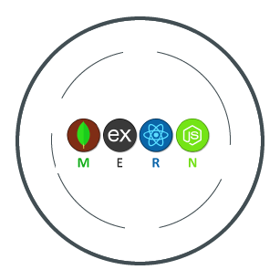

# Portable MERN Stack



A Portable, Docker Compose powered MERN (MongoDB, Express.JS, React, Node.js) Stack you can run anywhere!

## Getting Started

Install Docker and run w/Docker Compose:

```bash
docker-compose up --build
```

Access the local server at http://localhost:3000/

Bring the stack down:

```bash
docker-compose down --volumes
```

### Running in Development

You can run the development server with NPM:

```bash
npm i
npm start
```

Server runs on http://localhost:5000, and the React app proxies API requests to the Express server.

### Running in Production
Coming soon