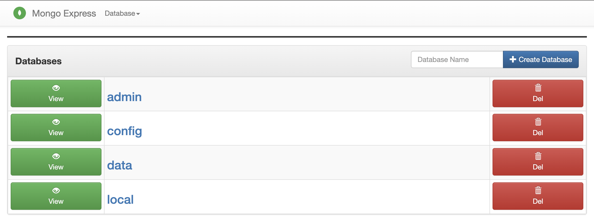

# Portable MERN Stack


A Portable, Docker Compose powered MERN (MongoDB, Express.JS, React, Node.js) Stack you can run anywhere!

## Getting Started

Install Docker and run w/Docker Compose:

```bash
docker-compose up --build
```

Access the local server at http://localhost:3000/

Bring the stack down:

```bash
docker-compose down --volumes
```

### Running in Development

You can run the development server with NPM:

```bash
npm i
npm start
```

If you change the server, you can re-build the container:

```bash
docker-compose down --volumes
docker-compose up --build
```
### Mongo DB

The Mongo database does not expose port `27017` by default and is only accessible to the Express Server. If you'd like to change this see comments in the docker-compose.yml file to expose ports and set password/security. For more details on container arguments/properties: https://hub.docker.com/_/mongo

### Express Server
The server runs on port 5000 within the container which the `client` is linked to. The docker `link` ensures that the server port is not exposed to the host and only the client can access it. The React app proxies API requests to the Express server. The React client app will run on http://localhost:3000 and is exposed to the host. If you were running on a web server, you can change the port as commented in the docker-compose to PORT 80 or 443.

> NOTE: By default Port 5000, orn 27017 (mongodb) are **NOT** exposed by the stack. This is for optimial security, if developing and you want to access the server or database, just uncomment the `ports` section in the docker-compose file for the server and mongo services, as well as the EXPOSE parameter in the server/Dockerfile.

### Mongo Express

Mongo Express is running by default on port `8081` you can manage your MongoDB database there, and access with username/password defined in the docker-compose file. To NOT run the mongo express server, just comment out/remove the `mongo-express` service from the docker-compose.yml file.



Environment vairables are passed to the run command for configuring a mongo-express container.

Name                            | Default         | Description
--------------------------------|-----------------|------------
ME_CONFIG_BASICAUTH_USERNAME    | ''              | mongo-express web username
ME_CONFIG_BASICAUTH_PASSWORD    | ''              | mongo-express web password
ME_CONFIG_MONGODB_ENABLE_ADMIN  | 'true'          | Enable admin access to all databases. Send strings: `"true"` or `"false"`
ME_CONFIG_MONGODB_ADMINUSERNAME | ''              | MongoDB admin username
ME_CONFIG_MONGODB_ADMINPASSWORD | ''              | MongoDB admin password
ME_CONFIG_MONGODB_PORT          | 27017           | MongoDB port
ME_CONFIG_MONGODB_SERVER        | 'mongo'         | MongoDB container name. Use comma delimited list of host names for replica sets.
ME_CONFIG_OPTIONS_EDITORTHEME   | 'default'       | mongo-express editor color theme, [more here](http://codemirror.net/demo/theme.html)
ME_CONFIG_REQUEST_SIZE          | '100kb'         | Maximum payload size. CRUD operations above this size will fail in [body-parser](https://www.npmjs.com/package/body-parser).
ME_CONFIG_SITE_BASEURL          | '/'             | Set the baseUrl to ease mounting at a subdirectory. Remember to include a leading and trailing slash.
ME_CONFIG_SITE_COOKIESECRET     | 'cookiesecret'  | String used by [cookie-parser middleware](https://www.npmjs.com/package/cookie-parser) to sign cookies.
ME_CONFIG_SITE_SESSIONSECRET    | 'sessionsecret' | String used to sign the session ID cookie by [express-session middleware](https://www.npmjs.com/package/express-session).
ME_CONFIG_SITE_SSL_ENABLED      | 'false'         | Enable SSL.
ME_CONFIG_SITE_SSL_CRT_PATH     | ''              | SSL certificate file.
ME_CONFIG_SITE_SSL_KEY_PATH     | ''              | SSL key file.

---

The following are only needed if 
**ME_CONFIG_MONGODB_ENABLE_ADMIN** is "false"

Name                            | Default         | Description
--------------------------------|-----------------|------------
ME_CONFIG_MONGODB_AUTH_DATABASE | 'db'            | Database name
ME_CONFIG_MONGODB_AUTH_USERNAME | 'admin'         | Database username
ME_CONFIG_MONGODB_AUTH_PASSWORD | 'pass'          | Database password

---

**mongo-express should only be used privately for development purposes.**

## Running in Production
Coming soon